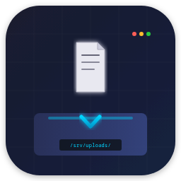
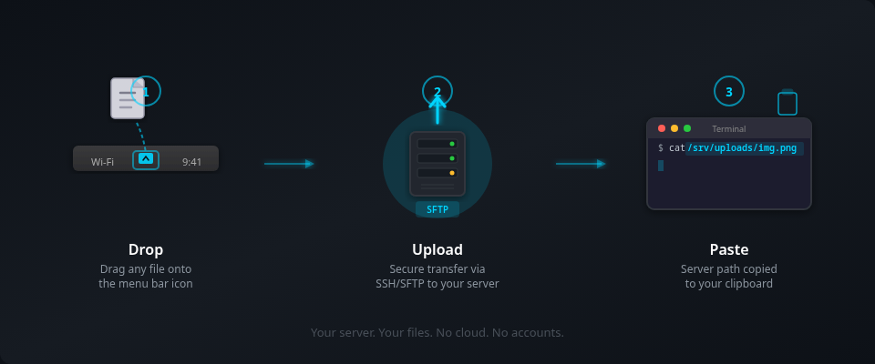

<p align="center">
  
</p>

<h1 align="center">DropShot</h1>

<p align="center">
  <strong>Drop a file on your menu bar. Get the server path in your clipboard.</strong>
</p>

<p align="center">
  <a href="https://github.com/kojott/dropshot/actions/workflows/ci.yml"></a>
  
  <a href="LICENSE"></a>
  
  
</p>

<p align="center">
  
</p>

---

## What is DropShot?

DropShot is a macOS menu bar utility that uploads files to your own server via SFTP and copies the absolute server path straight to your clipboard. It is built for developers who live in tmux sessions and terminals where drag-and-drop does not work -- you drop a file on the menu bar icon, it uploads over SFTP, and the remote path (like `/srv/uploads/screenshot.png`) is ready to paste into any SSH session. No third-party cloud services, no expiring links, no accounts -- just your server.

## Features

- **Drag-and-drop upload** -- drop any file onto the menu bar icon to upload instantly
- **Screenshot capture** -- take a region screenshot with a global shortcut (Command+Shift+U) and upload it in one step
- **Server path or public URL** -- copies the absolute server path to clipboard by default, with an optional public URL mode for web-accessible files
- **Full Unicode support** -- handles Czech diacritics, CJK characters, emoji filenames, and everything in between
- **SSH key auto-detection** -- finds your `id_ed25519`, `id_rsa`, or `id_ecdsa` keys automatically, with support for ssh-agent and 1Password SSH agent
- **macOS Keychain integration** -- stores credentials securely in the system Keychain
- **Upload queue** -- queue multiple files with real-time progress indicators and per-file cancellation
- **Host key verification** -- trust-on-first-use (TOFU) model with mismatch warnings to prevent MITM attacks
- **Network monitoring** -- detects connectivity changes and pauses/resumes uploads gracefully
- **Multi-file upload** -- drop multiple files at once; each path is copied on its own line
- **Duplicate filename handling** -- configurable behavior: append a numeric suffix (`-1`, `-2`, ...) or overwrite
- **Flexible filename patterns** -- keep the original name, prepend a timestamp, use a UUID, or a content hash
- **Accessibility** -- full VoiceOver support, keyboard navigation, and Reduce Motion compliance
- **Localization** -- ships with English and Czech translations

## Installation

### Download DMG

Download the latest `.dmg` from the [Releases](https://github.com/kojott/dropshot/releases/latest) page, open it, and drag **DropShot.app** into your Applications folder.

### Build from source

See [Building from Source](#building-from-source) below.

## Quick Start

1. **Install** DropShot using one of the methods above.
2. **Configure your server** -- click the menu bar icon, open Preferences, and enter your SFTP host, username, SSH key path, and remote upload directory (e.g. `/srv/uploads/`).
3. **Drop a file** on the menu bar icon (or press Command+Shift+U to take a screenshot).
4. **Paste the path** wherever you need it -- a terminal, an SSH session, a chat message. The absolute server path is already in your clipboard.

## Configuration

Open Preferences from the menu bar icon to configure:

| Setting | Description |
|---------|-------------|
| **Server** | Hostname, port, username, authentication method |
| **Remote Path** | Absolute directory on the server where files are uploaded |
| **Base URL** | Optional public URL prefix (enables URL mode instead of server path) |
| **Filename Pattern** | Original, date-time prefixed, UUID, or content hash |
| **Duplicate Handling** | Append numeric suffix or overwrite existing files |
| **File Size Limit** | Maximum upload size in MB (0 for unlimited) |
| **Launch at Login** | Start DropShot automatically when you log in |
| **Notifications** | Show macOS notifications on upload completion |

## Building from Source

### Prerequisites

- macOS 13.0 (Ventura) or later
- Xcode 15.0 or later (includes Swift 5.9)

### Build

```bash
git clone https://github.com/kojott/dropshot.git
cd DropShot
swift build
```

### Run

```bash
swift run DropShot
```

### Build for release

```bash
swift build -c release
```

The binary is placed in `.build/release/DropShot`.

## Running Tests

### Unit tests

```bash
swift test
```

### Integration tests with Docker

Integration tests run against a real SFTP server using the included Docker Compose configuration:

```bash
# Start the test SFTP server
docker compose -f docker-compose.test.yml up -d

# Run integration tests
swift test --filter IntegrationTests

# Tear down
docker compose -f docker-compose.test.yml down -v
```

The Docker setup spins up an [atmoz/sftp](https://github.com/atmoz/sftp) container on port 2222 and an nginx container on port 8080 for testing public URL mode.

## Contributing

Contributions are welcome. Please read [CONTRIBUTING.md](CONTRIBUTING.md) before submitting a pull request.

## Security

DropShot takes security seriously:

- **SSH credentials** are stored in the macOS Keychain and never written to disk in plain text.
- **Host key verification** uses a trust-on-first-use model. On first connection, you are shown the server's key fingerprint and asked to confirm. If the key changes on a subsequent connection, DropShot warns you about a possible man-in-the-middle attack.
- **No telemetry** -- DropShot does not phone home or collect any data. All communication is strictly between your Mac and your server.

If you discover a security vulnerability, please report it privately by emailing the maintainers rather than opening a public issue.

## License

DropShot is released under the [MIT License](LICENSE).

## Acknowledgments

- [KeyboardShortcuts](https://github.com/sindresorhus/KeyboardShortcuts) by Sindre Sorhus -- global keyboard shortcut handling
- [Sparkle](https://sparkle-project.org/) -- auto-update framework (planned for a future release)
- [atmoz/sftp](https://github.com/atmoz/sftp) -- Docker image used for integration testing
